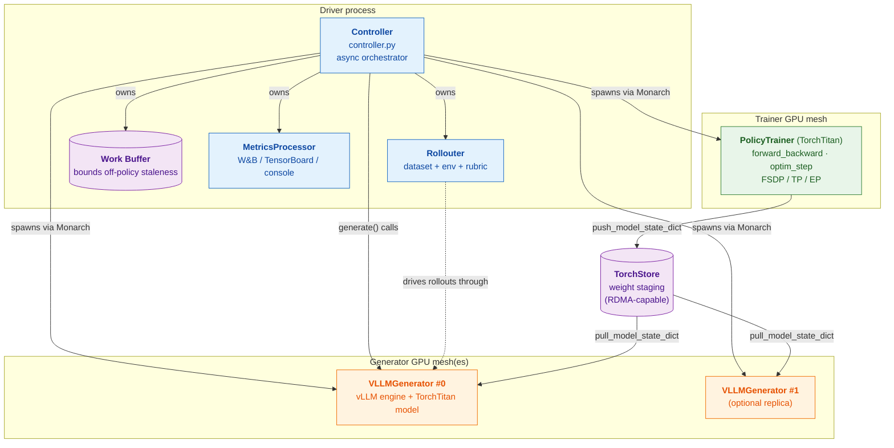
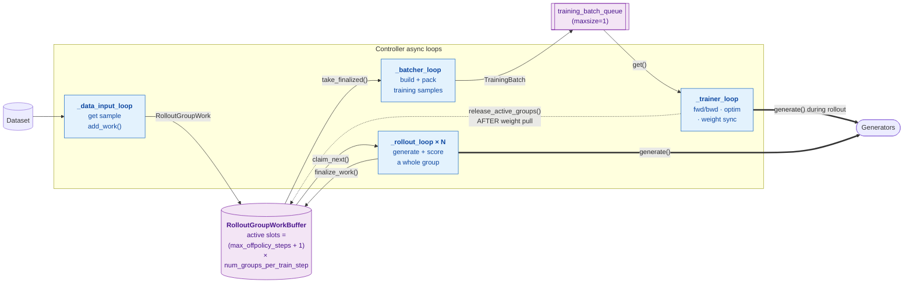
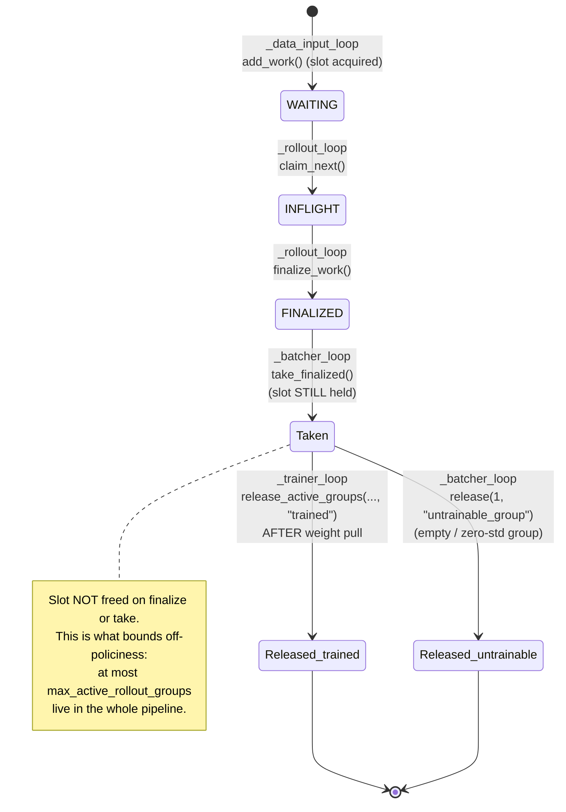
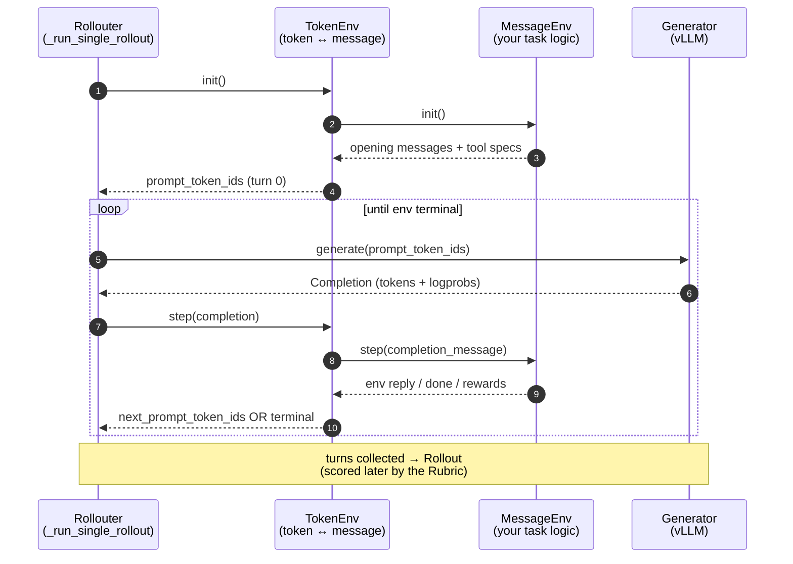
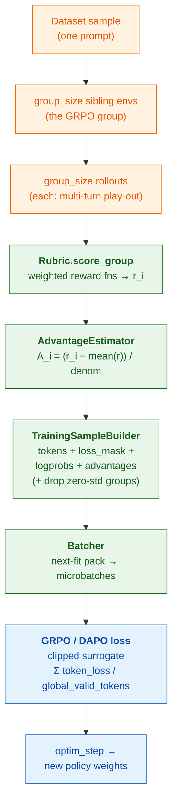
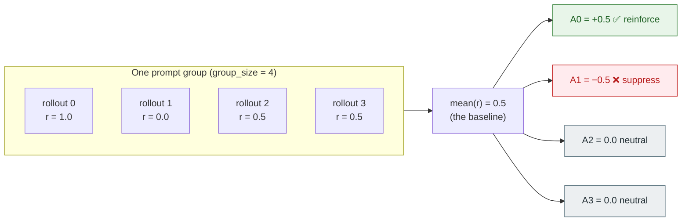
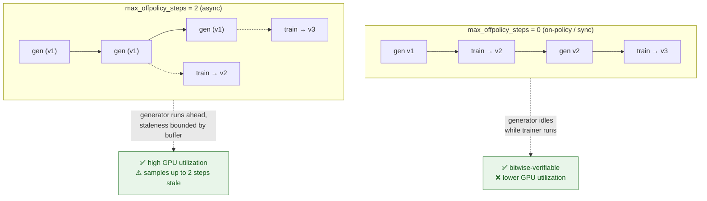
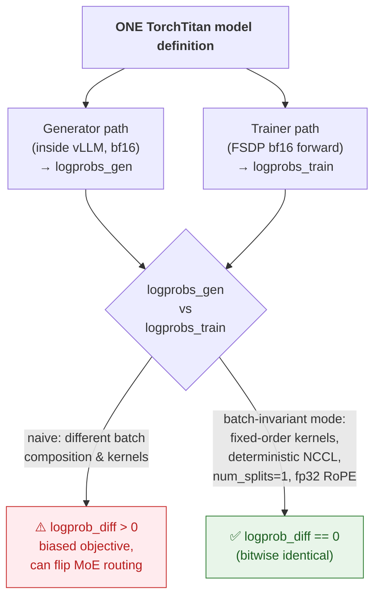
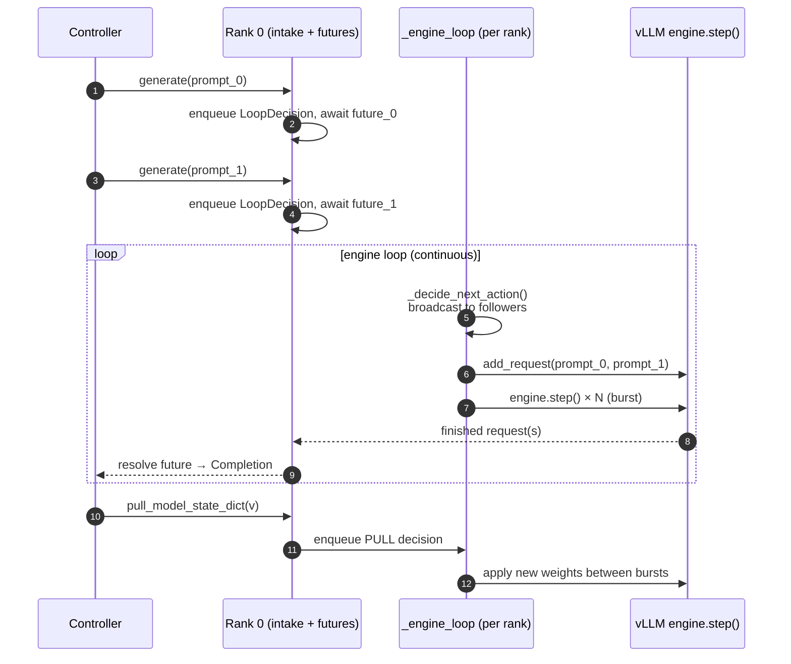

# TorchTitan RL Experiment — Visual Diagrams

> **Source of truth: the code (`torchtitan/experiments/rl/`).** These diagrams are hand-authored renderings of that code. When in doubt, trust the code first. Between the two diagram formats, **Mermaid is canonical** (diffable, version-controlled, renders on GitHub); the **Excalidraw files are the editable rendering** derived from it. They are not auto-synced, so minor wording/layout differences between a Mermaid diagram and its Excalidraw twin are cosmetic, not factual.
>
> Companion to `RL_EXPERIMENT_DEEP_DIVE.md`. Read this bottom-up: each diagram builds on the one before.
> Diagrams are [Mermaid](https://mermaid.js.org/) — they render automatically on GitHub. Editable Excalidraw versions live in `diagrams/*.excalidraw` (open at excalidraw.com or with the VS Code Excalidraw extension).
>
> **Editable Excalidraw files available** (`diagrams/`):
> | # | Diagram | File |
> |---|---------|------|
> | 1 | System architecture | `01_system_architecture.excalidraw` |
> | 2 | Async pipeline | `02_async_pipeline.excalidraw` |
> | 3 | Work-buffer state machine | `03_buffer_state_machine.excalidraw` |
> | 5 | Prompt → gradient | `05_prompt_to_gradient.excalidraw` |
> | 6 | GRPO advantage | `06_grpo_advantage.excalidraw` |
> | 8 | On-policy vs off-policy | `08_on_vs_off_policy.excalidraw` |
> | 9 | Bitwise parity | `09_bitwise_parity.excalidraw` |

---

## Diagram 1 — System architecture (the 30,000-ft view)

Who owns whom, and where the GPUs are. The Controller is the brain; the Trainer and Generators run on **disjoint GPU meshes**; weights flow one way (trainer → generators) through TorchStore.

**Read it as:** the Controller spawns actors on separate meshes (Monarch), asks generators to `generate`, feeds results through the buffer to the trainer, and after each optimizer step ships new weights to the generators via TorchStore.

---

## Diagram 2 — The async pipeline (the beating heart)

Five `asyncio` loops form a producer→consumer pipeline glued together by the shared work buffer. This is the single most important picture in the whole system.

**Backpressure is the trick:** the data-input loop can only add work when the buffer has a free slot, and slots are released **only after the trainer's weight pull** — so generation can run ahead, but never far enough to produce a "born-stale" sample.

---

## Diagram 3 — Work buffer: one group's lifecycle (state machine)

Every prompt group is a `RolloutGroupWork` that walks this state machine. Note the subtle-but-critical detail: **the active slot is held until the trainer explicitly releases it**, not when the group is finalized or taken.

---

## Diagram 4 — One rollout, turn by turn (sequence)

Zooming into a single rollout: the Rollouter alternates between the environment and the generator until the env says `done` (or a limit trips). `TokenEnv` is the translator that keeps everything else in message-space.

---

## Diagram 5 — How a dataset prompt becomes a gradient (data transformation)

The end-to-end transformation of *one prompt* into *training signal*. This is the GRPO pipeline made concrete.

---

## Diagram 6 — GRPO advantage intuition (why "group relative")

GRPO has **no value network**. The baseline is just the *mean reward of the sibling group*. A rollout that beats its siblings gets a positive advantage; one that lags gets negative. Simple and cheap.

> `denom = 1.0` → Dr.GRPO (mean baseline only). `denom = std(r) + eps` → standard GRPO.

---

## Diagram 7 — Weight sync overlapped with the next step (timeline)

The trainer never sits idle waiting for weights to ship. Push→pull→slot-release for step *N* run **in the background, overlapped with step N+1's forward/backward**. The trainer only *blocks* on the previous sync at the last safe moment.

```mermaid
gantt
    title Weight sync overlaps compute (per training step)
    dateFormat X
    axisFormat %s
    section Step N
    forward_backward         :a1, 0, 3
    wait prev push (block)   :a2, 3, 1
    optim_step               :a3, 4, 1
    wait prev pull (block)   :a4, 5, 1
    section Background sync (N)
    push weights → TorchStore :crit, b1, 5, 2
    pull weights → generators :crit, b2, 7, 2
    release buffer slots      :b3, 9, 1
    section Step N+1
    forward_backward          :c1, 6, 3
```

**Takeaway:** the striped background bars (push/pull) run concurrently with step N+1's compute, so weight sync is mostly hidden.

---

## Diagram 8 — On-policy vs off-policy (the staleness window)

The `max_offpolicy_steps` knob sets how far generation may run ahead of training. `0` = strict lockstep (needed for bitwise parity); `>0` = generators stay busy while the trainer works.

---

## Diagram 9 — Bitwise parity: why the unified model matters

The correctness bug this whole experiment is designed to kill. Two code paths compute logprobs; if they disagree, the importance ratio `π_θ/π_old` is wrong. The unified model + batch-invariant mode drives the difference to **exactly zero**.

> Cost (Qwen3-8B, Search-R1, 8×H100): raw compute ~2.4–2.9× slower, but end-to-end wall-clock ≈ unchanged for orchestration-bound workloads. Requires matched TP; no sequence parallelism.

---

## Diagram 10 — Generator internals (continuous batching)

Inside one `VLLMGenerator`: rank 0 accepts requests and enqueues decisions; a background engine loop runs `engine.step()` bursts so new requests join mid-flight instead of waiting for the batch to drain. Weight pulls ride the same loop.

---

*These diagrams are a learning aid. The code is the source of truth — cross-check against `torchtitan/experiments/rl/` (it moves fast).*
